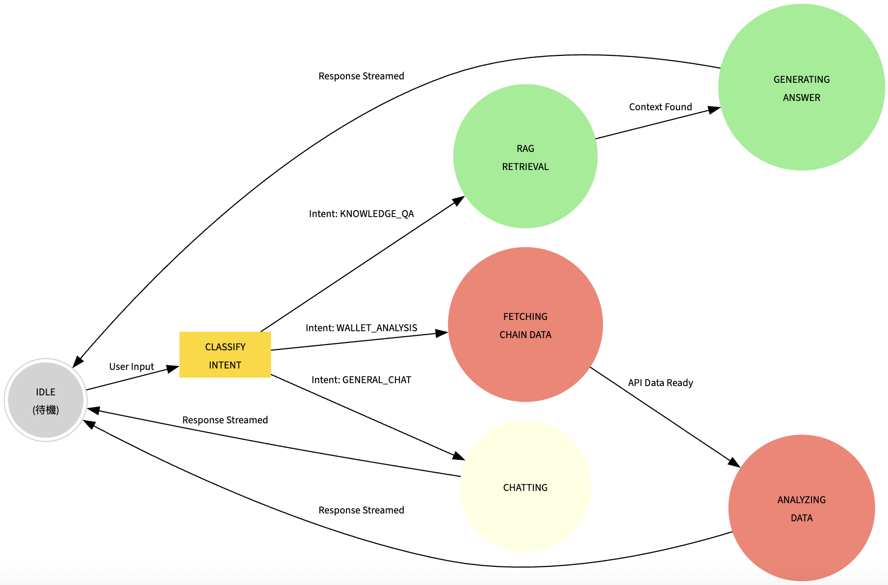
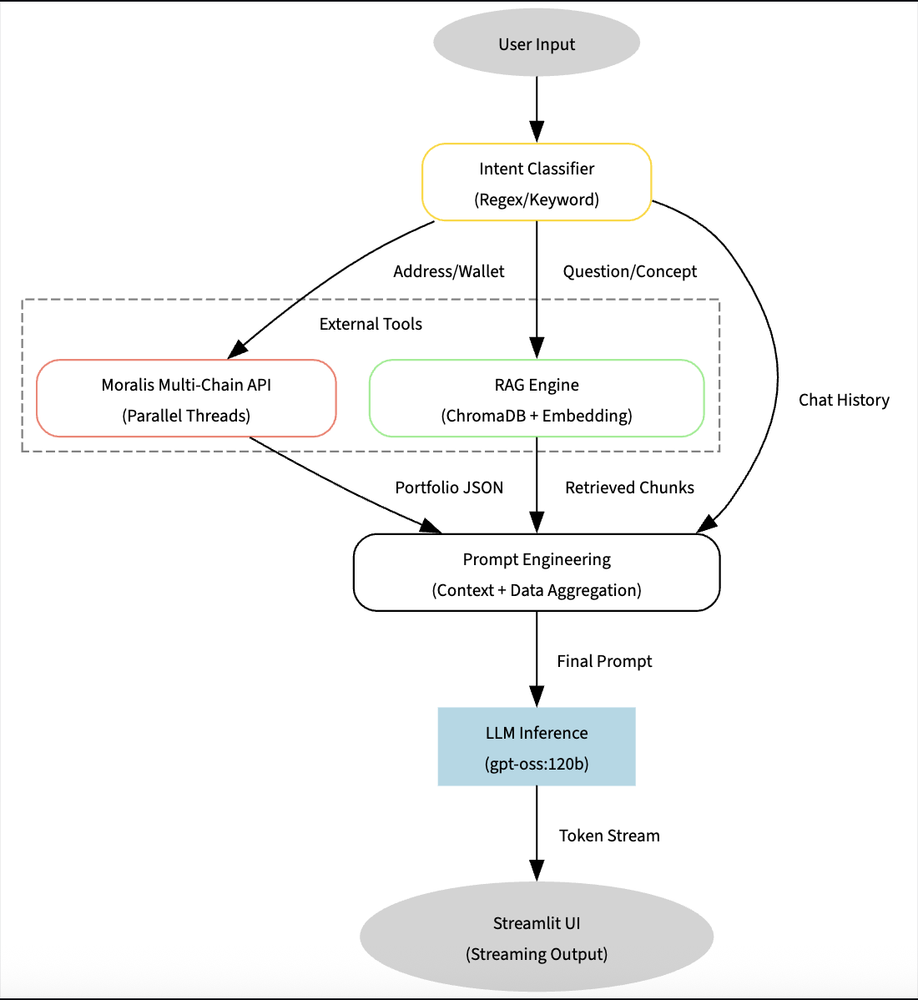

# Blockchain AI Agent (TOC Final Project)

**Course:** Theory of Computation (TOC) - Final Project
**Model:** gpt-oss:120b (NCKU Server)

## Project Overview

This project implements a Blockchain Intelligent Assistant integrating **Finite State Machine (FSM)** theory with **Large Language Models (LLM)**. Unlike standard chatbots, this system utilizes a **Deterministic Finite Automaton (DFA)** architecture to manage conversation states, ensuring predictable and robust system behavior.

The system integrates **RAG (Retrieval-Augmented Generation)** and **Moralis Multi-Chain API** to provide real-time on-chain asset analysis, scam token filtering, and evidence-based knowledge retrieval.

### Key Features

  * **Theoretical Implementation**: Agent decision logic based on FSM design (Idle -\> Classify -\> RAG/Fetch -\> Gen).
  * **Multi-Chain Analysis**: Concurrent scanning of 7 major public chains (Ethereum, BSC, Polygon, Arbitrum, etc.) using threading.
  * **Security & Anti-Spam**: Built-in sanitization layer to automatically filter scam tokens and abnormal assets.
  * **Hybrid RAG**: Capable of switching between specific knowledge base retrieval and general LLM knowledge (Hybrid Mode).
  * **Streaming Response**: Implements full streaming response and status feedback UI to handle high-latency server environments.

## System Architecture

The agent operates as a state machine with the following data flow:

1.  **User Input**: Receives natural language queries.
2.  **Intent Classifier**: Determines the user's intent (Wallet Analysis / Knowledge QA / General Chat).
3.  **State Transition**:
      * **WALLET\_ANALYSIS**: Triggers Moralis API (Multi-threaded) -\> Data Sanitization -\> LLM Analysis.
      * **KNOWLEDGE\_QA**: Triggers ChromaDB Retrieval -\> Hybrid Prompt Construction -\> LLM Response.
4.  **Output**: Streams the generated response via the Streamlit UI.

## Installation and Setup

Follow these steps to set up the environment for demonstration.

### 1\. Prerequisites

  * Python 3.10 or higher
  * Git

### 2\. Clone Repository

```bash
git clone git@github.com:edwei06/TOC_Final.git
cd <YOUR_PROJECT_FOLDER>
```

### 3\. Create Virtual Environment (Recommended)

```bash
# macOS / Linux
python3 -m venv venv
source venv/bin/activate

# Windows
python -m venv venv
venv\Scripts\activate
```

### 4\. Install Dependencies

```bash
pip install -r requirements.txt
```

## Configuration

This project requires API keys for the **NCKU LLM Server** and **Moralis API**. Please configure the following files:

**1. LLM Configuration (`llm_client.py`)**
Open the file and update the `API_KEY` variable:

```python
API_KEY = "ENTER_YOUR_NCKU_API_KEY_HERE"
# Ensure URL is set to: https://api-gateway.netdb.csie.ncku.edu.tw/api/generate
```

**2. Blockchain Data Configuration (`blockchain_tools.py`)**
Open the file and update the `MORALIS_API_KEY` variable:

```python
MORALIS_API_KEY = "ENTER_YOUR_MORALIS_API_KEY_HERE"
```

## How to Run

Execute the following command in the terminal to start the application:

```bash
streamlit run main.py
```

The web interface will open automatically in your default browser (default URL: `http://localhost:8501`).

## Test Scenarios for Demo

The following scenarios verify the core functionalities of the system:

### Scenario 1: Multi-Chain Wallet Analysis

Tests the system's ability to query cross-chain assets and filter scam tokens.

  * **Input**: `幫我分析 Vitalik 的錢包` (or analyze address: `0xd8dA6BF26964aF9D7eEd9e03E53415D37aA96045`)
  * **Expected Output**:
      * UI status shows connection to Moralis API.
      * Displays Total Net Worth (USD).
      * Table lists top holdings (ETH should be dominant).
      * Spam tokens (e.g., AAA, CATE) are filtered out.

### Scenario 2: RAG Knowledge Retrieval

Tests the system's ability to retrieve information from local private documents.

  * **Input**: `什麼是 TOC Coin`
  * **Expected Output**:
      * System retrieves context from `documents/secret_project.txt`.
      * Response accurately describes the custom definition of "TOC Coin".

### Scenario 3: General Knowledge (Fallback)

Tests the fallback mechanism when RAG retrieves no relevant data.

  * **Input**: `解釋一下什麼是以太坊`
  * **Expected Output**:
      * System acknowledges no private data found and switches to general knowledge.
      * LLM provides a standard explanation of Ethereum.

## File Structure

  * **main.py**: Frontend entry point (Streamlit UI).
  * **agent\_core.py**: Core logic (State Machine & Intent Classifier).
  * **blockchain\_tools.py**: Data layer (Moralis API, Multi-threading, Anti-Spam).
  * **llm\_client.py**: Connection layer (NCKU Server API Client).
  * **rag\_engine.py**: Memory layer (RAG, ChromaDB, PDF Processor).
  * **documents/**: Knowledge base folder (PDF/TXT files).
  * **requirements.txt**: Python dependencies list.
  * **README.md**: Project documentation.

## Troubleshooting

  * **Slow Response**: The 120B model on the school server has high latency. The system implements a queueing mechanism. Please wait 20-50 seconds for the streaming to begin. A timeout of 120 seconds is configured.
  * **Missing Tokens**: The system includes a strict whitelist/blacklist and value filter (\>$10 USD) for security reasons. Low-value or spam assets are automatically hidden.
  * **ModuleNotFoundError**: Ensure all dependencies are installed using `pip install -r requirements.txt`.

-----

### Appendix: requirements.txt

```text
streamlit
requests
chromadb
sentence-transformers
pypdf
tf-keras
graphviz
python-dotenv
```
# FSM chart:

# DAG chart:

在我的電腦上的設定
1. ```conda create -n toc_agent python=3.10```
2. ```conda activate toc_agent```
3. ```pip install requirement.txt```